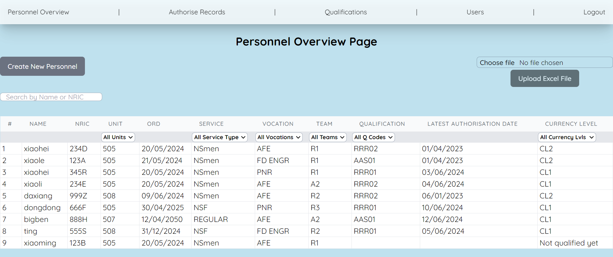
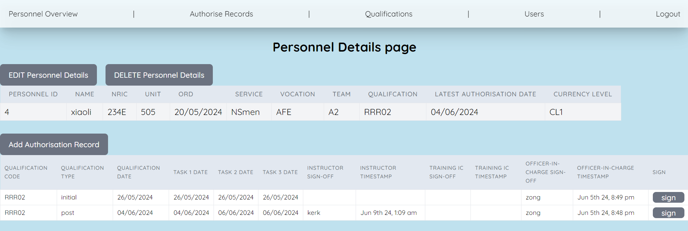
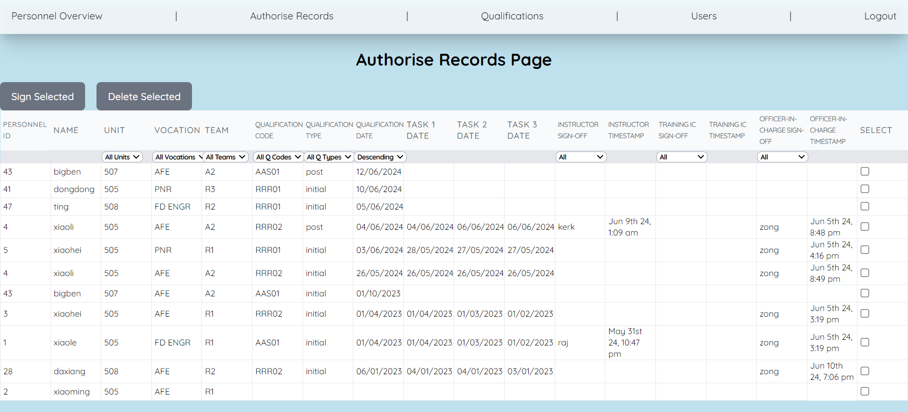

# Training Records Manager

This app is a prototype to help digitalise the training records which are currently done via hardcopy, and manually keyed into an excel sheet.

## Navigation

- Deployed on https://training-records.onrender.com/
- login via given access (guest@defence, guest || admin@defence, admin)
- navigate to personnel overview or authenticate records via navbar
  - extended to qualfications and users(if admin)
- click on personnel row to get personnel-details page.
  - click on buttons to add authorisations or edit personnel details
  - click on existing authorisation rows to edit

## User Story

As a user (OIC, TrainingIC or Instructor):

- i want to have an overall view of the trainees/personnel, including their latest qualification date and currency levels.
- i want to be able to add trainees/personnel as they are posted into the unit.
- i want to be able to add their authorisation records as they progress in their training.
- i want to be able to sign off the records (to endorse/approve) based on my user appointment.
- i want to be able to sign off multiple records at once (as trainees are batch managed)
- as part of the onboarding process, i also want to be able to upload existing records (via excel) into this database for the transition.

As an Admin/OIC,

- i want to be able to amend the available courses and respective training code.
- i want to be able to enroll new users as they take on the appointments above.

## ScreenShots

Personnel Overview Page

Personnel Details Page

Authorise Records Page

## Favourite Functions

- Uploading of excel sheet
- Was added in only at the end:
  - but once familiar with pgSQL, the query portion in server side was relatively simple.
  - only had to figure out how to parse the data from xlsx file into react state, which were done using js libraries.

## Challenges

- Deciding on and setting up the linkage for the SQL tables in the planning phase, including type of data for each column.
- The schema was more difficult to change on later as compared to using MongoDB.

## Technologies & Libraries

- PostgreSQL
- Express
- React
- Node JS
- Tailwind CSS
- node-cron (for db update)
- moment (for timezone handling)
- xlsx & papaparse (for excel & csv file reading)

## IceBox

- setting up validation and constraints based on date inputs.
- multi-user transactions
- shift filtering function to server
- Oauth authentication and Digital Signature
